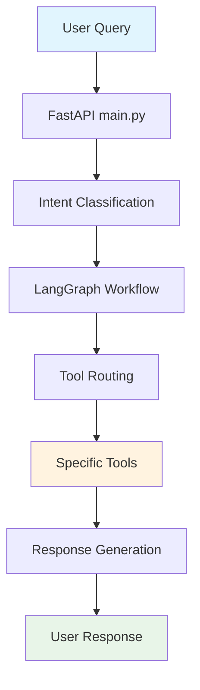

# 🤖 LLM Backend Playground

<div align="center">


**A modular multi-agent backend for routing natural language queries to the right tool**
*Math, Weather, LLM, and more - powered by FastAPI, LangGraph, and Gemini/OpenAI APIs*

[🚀 Quick Start](#-quick-start) • [🐳 Docker](#-docker-deployment) • [🛠️ Development](#️-local-development) • [📚 API Docs](#-api-endpoints)

</div>

---

## ✨ Features

- 🧠 **Smart Intent Classification** - Automatically routes queries to the right tool
- 🔧 **Modular Tool Architecture** - Easy to add new tools and capabilities
- 🌤️ **Weather Integration** - Real-time weather data via OpenWeatherMap API
- 🧮 **Mathematical Processing** - Safe expression evaluation
- 🤖 **LLM Integration** - Powered by Google Gemini for general knowledge
- 🐳 **Docker Ready** - Complete containerization with version tagging
- ⚡ **FastAPI Performance** - High-performance async API framework
- 🔄 **Auto-reload Development** - Hot reload for faster development

---

## 🚀 Quick Start

### Option 1: Automated Setup (Recommended) ⭐
**<span style="color: red">⚠️ Note: This setup has only been tested on Ubuntu environments.</span>**

```bash
git clone git@github.com:MuhammadAgf/llm_be_playground.git
cd llm_be_playground
make setup  # Installs all prerequisites and sets up the environment
```

**After automated setup, you still need to configure your API keys:**

```bash
# Copy environment template
cp .env.example .env

# Edit the .env file with your API keys
vim .env  # or use your preferred editor
```

**Required API Keys:**
- `GEMINI_API_KEY` - Get from [Google AI Studio](https://makersuite.google.com/app/apikey)
- `OPENWEATHER_API_KEY` - Optional, get from [OpenWeatherMap](https://openweathermap.org/api) (uses mock data if not provided)

### Option 2: Manual Setup
```bash
# 1. Clone the repository
git clone git@github.com:MuhammadAgf/llm_be_playground.git
cd llm_be_playground

# 2. Install Python 3.11+ if not already installed
# Ubuntu/Debian:
sudo apt update && sudo apt install python3.11 python3.11-venv python3-pip

# macOS (with Homebrew):
brew install python@3.11

# 3. Create and activate virtual environment
python3 -m venv venv
source venv/bin/activate  # On Windows: venv\Scripts\activate

# 4. Install dependencies
pip install -r requirements.txt

# 5. Set up environment variables
cp .env.example .env

# 6. Edit .env with your API keys
vim .env  # or use your preferred editor
```

**Required API Keys:**
- `GEMINI_API_KEY` - Get from [Google AI Studio](https://makersuite.google.com/app/apikey)
- `OPENWEATHER_API_KEY` - Optional, get from [OpenWeatherMap](https://openweathermap.org/api) (uses mock data if not provided)

---

## 🚀 After Setup - Running the Application

### For Local Development
```bash
# Activate virtual environment (if not already active)
source venv/bin/activate  # On Windows: venv\Scripts\activate

# Run in development mode (with auto-reload)
make dev

# Or run in production mode
make run
```

### For Docker Deployment
```bash
# Run with Docker Compose (recommended)
make docker-compose-up

# Or run with Docker directly
make docker-run
```

### Verify Installation
- 🌐 Visit [http://localhost:8000/docs](http://localhost:8000/docs) for API documentation
- 🔍 Check health: `curl http://localhost:8000/health`
- 🧪 Test with a query: `curl -X POST http://localhost:8000/query -H 'Content-Type: application/json' -d '{"query": "What is 2 + 2?"}'`

---

## 🐳 Docker Deployment

### Using Docker Compose (Easiest) 🎯
```bash
# Build and run with docker-compose (uses git version tagging)
make docker-compose-up

# Build latest version (no cache)
make docker-compose-build

# View logs
make docker-compose-logs

# Stop the service
make docker-compose-down
```

### Using Docker directly
```bash
# Build the image with git version tagging
make docker-build

# Build latest version (no cache)
make docker-build-latest

# Run the container with specific git version
make docker-run

# Run the container with latest tag
make docker-run-latest

# Stop the container
make docker-stop

# Clean up (stop and remove container/image)
make docker-clean

# Show current version info
make version
```

### Manual Docker commands
```bash
# Build with git version
GIT_VERSION=$(git describe --tags --always --dirty) docker build -t llm-be-playground:${GIT_VERSION} -t llm-be-playground:latest .

# Run with environment file
docker run --env-file .env -p 8000:8000 llm-be-playground:${GIT_VERSION}

# Or run with docker-compose (uses git version automatically)
GIT_VERSION=$(git describe --tags --always --dirty) docker-compose up -d
```

---

## 🛠️ Local Development

### Prerequisites
- 🐍 Python 3.11+
- 📦 pip
- 🔧 virtual environment (created automatically)

### Setup and Run
```bash
# Install dependencies and create virtual environment
make install

# Run in development mode (with auto-reload)
make dev

# Or run in production mode
make run
```

---

## 📁 Project Structure

```
llm_be_playground/
├── app/                          # Main application code
│   ├── tools/                    # Tool modules
│   │   ├── math_tools.py         # Mathematical expression evaluation
│   │   ├── weather_tools.py      # Weather data retrieval
│   │   ├── llm_tools.py          # Generic LLM-based Q&A
│   │   └── __init__.py           # Tool module exports
│   ├── main.py                   # FastAPI application entry point
│   ├── config.py                 # Application settings
│   ├── models.py                 # Pydantic data models
│   ├── agents.py                 # LangGraph agents
│   └── workflow.py               # LangGraph workflow definition
├── Dockerfile                    # Container configuration
├── docker-compose.yml            # Multi-container orchestration
├── Makefile                      # Development automation
├── setup.sh                      # Automated environment setup
├── requirements.txt              # Python dependencies
├── .env.example                  # Environment variables template
├── logs/                         # Application logs directory
└── .dockerignore                 # Docker build exclusions
```

### 🔄 Data Flow Architecture



### 🏗️ Key Design Patterns

1. **Multi-Agent System** 🧠 - Uses LangGraph agents for intent classification and task routing
2. **Tool-Based Architecture** 🔧 - Modular tools for different query types (math, weather, general)
3. **State Management** 📊 - QueryState model tracks query processing through the workflow
4. **Configuration Management** ⚙️ - Centralized settings with environment variable support

---

## 🔑 Environment Variables

| Variable | Required | Description | Example |
|----------|----------|-------------|---------|
| `GEMINI_API_KEY` | ✅ Yes | Google Gemini API key | `AIzaSyC...` |
| `OPENWEATHER_API_KEY` | ❌ No | OpenWeatherMap API key (uses mock data if not provided) | `1234567890abcdef` |

📝 See `.env.example` for all available variables

---

## 🛠️ Technology Stack

### 🏗️ Core Framework
- **FastAPI** - Modern, fast web framework for building APIs
- **Pydantic** - Data validation and settings management
- **LangGraph** - Multi-agent workflow orchestration
- **Pydantic-AI** - LLM integration and agent management

### 🤖 AI/ML Components
- **Google Gemini** - Primary LLM for intent classification and general queries
- **OpenWeatherMap API** - Weather data retrieval
- **Mathematical Expression Evaluation** - Safe math computation

### 🚀 Development & Deployment
- **Docker** - Containerization for consistent deployment
- **Docker Compose** - Multi-service orchestration
- **Uvicorn** - ASGI server for FastAPI
- **Python 3.11+** - Modern Python with type hints support

---

## 🧪 Testing the API

After running (locally or with Docker):
- 📖 Visit [http://localhost:8000/docs](http://localhost:8000/docs) for Swagger UI
- 🔧 Or use curl examples below:

### 🌤️ Weather Query
```bash
curl -X POST http://localhost:8000/query \
  -H 'Content-Type: application/json' \
  -d '{"query": "What'\''s the weather like today in Jakarta"}'
```

<details>
<summary>📋 Response Example</summary>

```json
{
  "query": "What's the weather like today in Jakarta",
  "tool_used": "weather_tool",
  "result": "🌤️ Weather Report for Jakarta, ID\n🌡️ Temperature: -4°C\n☁️ Condition: sunny\n💧 Humidity: 33%"
}
```
</details>

### 🧮 Math Query
```bash
curl -X POST http://localhost:8000/query \
  -H 'Content-Type: application/json' \
  -d '{"query": "What is the square root of 9 times 16"}'
```

<details>
<summary>📋 Response Example</summary>

```json
{
  "query": "What is the square root of 9 times 16",
  "tool_used": "math_tool",
  "result": "12.0"
}
```
</details>

### 🤖 General Knowledge Query
```bash
curl -X POST http://localhost:8000/query \
  -H 'Content-Type: application/json' \
  -d '{"query": "Who is the president of France"}'
```

<details>
<summary>📋 Response Example</summary>

```json
{
  "query": "Who is the president of France",
  "tool_used": "llm_tool",
  "result": "Emmanuel Macron is the president of France."
}
```
</details>

---

## 🔌 API Endpoints

### 📡 Core Endpoints
| Method | Endpoint | Description |
|--------|----------|-------------|
| `GET` | `/health` | Health status |
| `POST` | `/query` | Main query processing endpoint |

### 🔄 Query Processing Flow
1. **Intent Classification** 🧠 - The system analyzes the query to determine intent (math, weather, or general)
2. **Tool Routing** 🔀 - Based on intent, routes to appropriate specialized tool
3. **Response Generation** 📤 - Tool processes query and returns structured response

### 🎯 Supported Query Types
- **Mathematical** 🧮 - "What is 15 * 23?", "Calculate 2^10"
- **Weather** 🌤️ - "What's the weather in Tokyo?", "Temperature in New York"
- **General** 🤖 - "What is machine learning?", "Explain quantum computing"

---

## 🛠️ Available Make Commands

### 🚀 Development
| Command | Description |
|---------|-------------|
| `make install` | Install Python dependencies |
| `make dev` | Run in development mode with auto-reload |
| `make run` | Run in production mode |
| `make clean` | Clean up Python cache files |

### 🐳 Docker
| Command | Description |
|---------|-------------|
| `make docker-build` | Build Docker image with git version tagging |
| `make docker-build-latest` | Build latest version (no cache) |
| `make docker-run` | Run Docker container with specific git version |
| `make docker-run-latest` | Run Docker container with latest tag |
| `make docker-stop` | Stop Docker container |
| `make docker-clean` | Stop and remove Docker container/image |
| `make version` | Show current git version and image details |

### 🐙 Docker Compose
| Command | Description |
|---------|-------------|
| `make docker-compose-up` | Start with docker-compose (uses git versioning) |
| `make docker-compose-build` | Build latest version with docker-compose |
| `make docker-compose-down` | Stop docker-compose services |
| `make docker-compose-logs` | View docker-compose logs |

### ⚙️ Setup
| Command | Description |
|---------|-------------|
| `make setup` | Run automated setup script |

---

## 📦 Production Deployment

- 🐳 Use Docker for deployment with git version tagging
- 🏥 Healthcheck endpoint: `/health`
- 🌐 Exposes port 8000 by default
- 🔄 Docker Compose includes restart policy, health checks, and version labels
- 🏷️ Images are tagged with git version for precise version control

---

## 🔧 Setup Script Features

The `setup.sh` script automatically:
- 🔍 Detects your operating system (Ubuntu, CentOS, Fedora, macOS)
- 🐍 Installs Python 3.11+ if not present
- 🐳 Installs Docker if not present
- 📡 Installs curl for health checks
- 🔧 Creates Python virtual environment
- 📦 Installs all Python dependencies
- 🏗️ Builds Docker image
- 🎨 Provides colored output and error handling

---

## 🏷️ Git Versioning

The project includes automatic git versioning for Docker images:

### 🏷️ Version Tagging
- **Automatic** 🔄 - Images are tagged with git version using `git describe --tags --always --dirty`
- **Dual Tags** 🏷️ - Each build creates both version-specific and `latest` tags
- **Examples** 📝:
  - `llm-be-playground:v1.2.3` (tagged release)
  - `llm-be-playground:dev-abc123` (development commit)
  - `llm-be-playground:latest` (always points to most recent build)

### 📊 Version Information
```bash
# Show current version details
make version

# Output example:
Git Version: 9af1c06-dirty
Git Commit: 9af1c06
Image Name: llm-be-playground
Image Tag: 9af1c06-dirty
```

### ✅ Benefits
- **Reproducibility** 🔄 - Run exact versions for debugging or rollbacks
- **Tracking** 📊 - Container labels include version and commit info
- **Flexibility** 🎯 - Choose between specific versions or latest
- **CI/CD Ready** 🚀 - Perfect for automated deployment pipelines

---

<div align="center">

## 📄 License

This project is licensed under the MIT License - see the [LICENSE](LICENSE) file for details.

---

⭐ **Star this repository if you found it helpful!** ⭐

</div>
